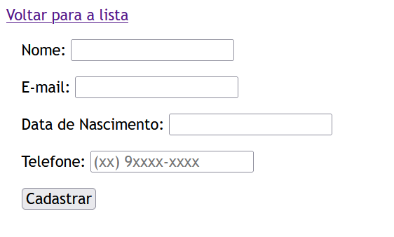
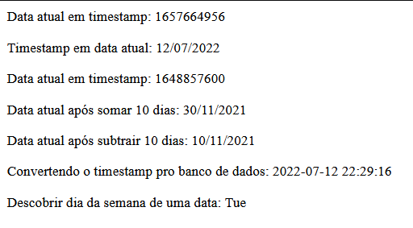
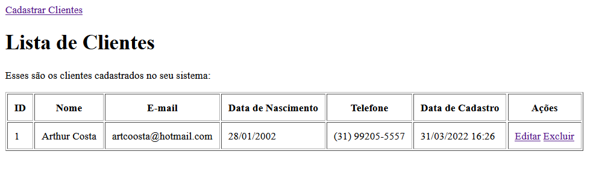
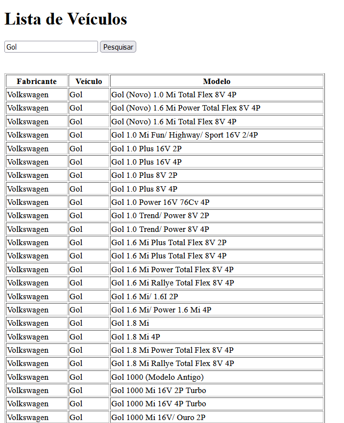

# curso_php

Pequenos projetos realizados durante o curso de PHP e MySQL feito na Udemy pelo Professor João Oliveira.

## Resultado

- O projeto consiste em um sistema de cadastro e login de usuário. Ele também realiza criptografia de senhas e persistencia dos dados no banco de dados. O sistema também manipula datas em diversos formatos, também permitindo o cadastro de clientes e exibição dos dados em uma tabela. Por fim, o projeto também permite a pesquisa em uma base de dados específica (Locação de veículos).

#### Tela de Cadastro

#### Manipulação das Datas

#### Lista de Clientes

#### Lista de Veículos

